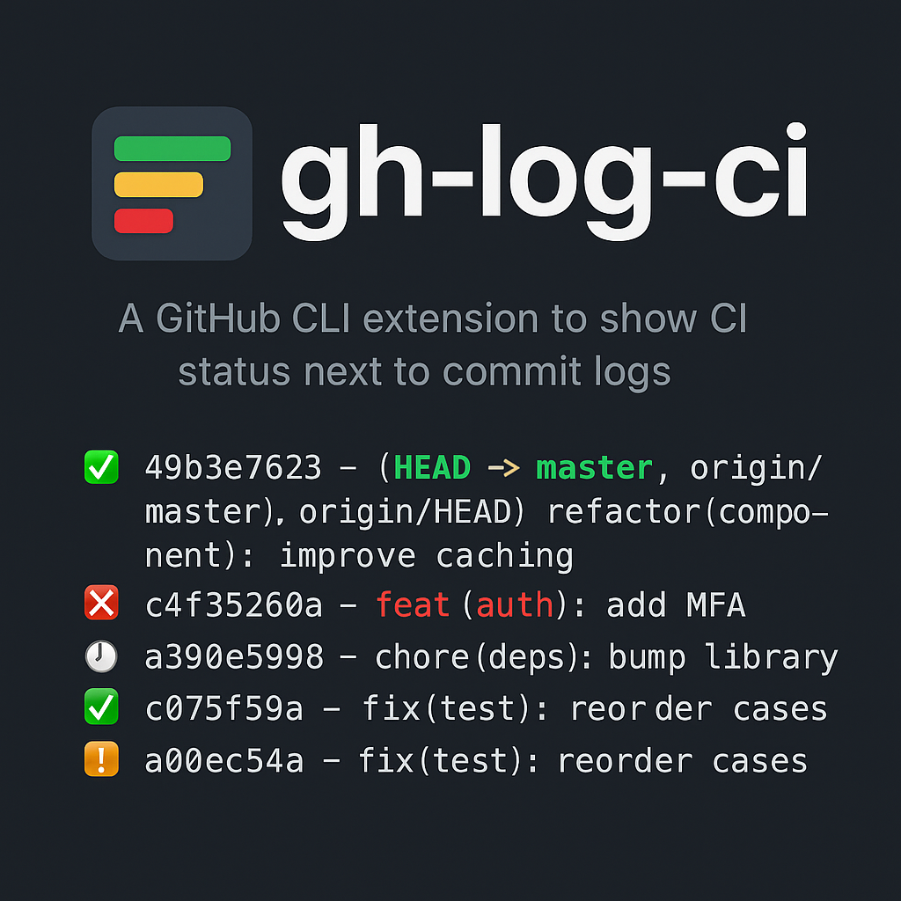

<p align="center">
  
</p>

<h1 align="center">gh-log-ci</h1>
<p align="center"><em>A GitHub CLI extension that shows CI status next to commit logs</em></p>

`gh log-ci` displays recent commits with an inline summary icon of their GitHub Check / Actions status so you can instantly see which commits are green, failing, pending, or cancelled.

## Quickstart

`gh log-ci` works with GitHub.com and GitHub Enterprise Server (any version that supports Checks API).

1. Install [GitHub CLI](https://cli.github.com/)
2. Authenticate: `gh auth login`
3. (Optional) Ensure you have access to private repos you care about
4. Clone a repository: `git clone https://github.com/OWNER/REPO && cd REPO`
5. Install the extension: `gh extension install xpepper/gh-log-ci` (or `gh extension install .` from local checkout)
6. Run: `gh log-ci`
7. Profit! ✅ 🚀

## Usage

Basic usage (auto-detect default branch):
```shell
gh log-ci
```
Specify a branch explicitly:
```shell
gh log-ci release-branch
```
Branch resolution order when no argument is provided:
1. GitHub default branch (`gh repo view --json defaultBranchRef --jq .defaultBranchRef.name`)
2. `master` if present
3. `main` if present
4. Current local HEAD branch

### Planned Flags (not yet implemented)
```
  --branch <name>      Use a specific branch (overrides auto-detect)
  --limit <n>          Number of commits to display (default 15)
  --format <text|json> Output format variant
  --help               Show help / usage
```

## Output Example
```
$ gh log-ci

my-repo

Commit status for my-org/my-repo (master):
-----------------------------------------
✅  49b3e7623 - (HEAD -> master, origin/master, origin/HEAD) refactor(component): improve caching (Wed Oct 22 15:15:13 2025 +0200) <Jane Doe>
❌  c4f35260a - feat(auth): add MFA (Wed Oct 22 09:25:09 2025 +0200) <John Smith>
🕓  a390e5998 - chore(deps): bump library (Tue Oct 21 16:52:40 2025 +0200) <dependabot[bot]>
```

## Icons Legend
| Icon | Meaning |
|------|---------|
| ✅ | At least one check run succeeded and no failures detected |
| ❌ | One or more check runs concluded with failure / timed_out / action_required |
| 🚫 | All check runs were cancelled |
| 🕓 | No check runs yet / still in progress / unknown state |
| ❔ | Fallback when state can't be determined |

## Features
| Capability | Description |
|------------|-------------|
| Auto branch | Detects default branch, falls back to master/main/HEAD |
| Status summary | Aggregates check run conclusions into a single icon |
| Colorized log | Mirrors `git log` pretty format with colors |
| Lightweight | Single Bash script, no external deps beyond `gh` |

## Permissions

`gh log-ci` uses the credentials configured via [`gh auth login`](https://cli.github.com/manual/gh_auth_login) or any supported `gh` environment variables. Required scopes depend on what you want to read:

Typical token (user) scopes:
- `repo` (private repository commit metadata & checks)
- `read:org` (if accessing private org repos)

GitHub App / server-to-server tokens need read access to:
- Repository Contents
- Repository Metadata
- Actions / Checks (implicitly via Checks API)

If you see authentication errors, re-run:
```shell
gh auth status
gh auth login
```

## How It Works
1. Determines branch (see order above).
2. Fetches commits from `origin/<branch>`.
3. Emits a tab-delimited `git log` for the last 15 commits.
4. For each commit, calls REST endpoint `/repos/{owner}/{repo}/commits/{sha}/check-runs`.
5. Maps combined conclusions to an icon and prints decorated line.

## Configuration (Current)
- Branch: positional argument (auto-detected if omitted).
- Commit count: fixed at 15.

## Limitations
- One API call per commit (performance impact on larger limits).
- Any failure marks commit ❌ even if other checks succeed.
- Pending vs in_progress conflated (🕓).
- No JSON / alternative formats yet.
- Assumes `origin` remote name.

## Roadmap
- Flags: `--branch`, `--limit`, `--format`, `--help`.
- More precise status aggregation (all green vs mixed).
- Parallel / batched (GraphQL) status retrieval.
- Cache recent commit statuses (temp file TTL).
- JSON / Markdown / table outputs.
- Filter by author / status / date.
- Include workflow names on demand.
- Add age column (e.g., `2h ago`).
- Shell tests (bats) & CI (shellcheck).
- Graceful rate-limit handling.
- Emoji-less / no-color modes for accessibility.

## Contributing
1. Fork and clone.
2. Create a feature branch.
3. Make changes + add tests (when available).
4. Open a PR.

## Troubleshooting
| Issue | Suggestion |
|-------|------------|
| Remote URL error | Ensure you're inside a GitHub repo with an `origin` remote |
| Auth errors | Run `gh auth status` then `gh auth login` |
| All 🕓 icons | Checks not started yet or using legacy status API |
| Slow output | Limit commits or wait between runs to avoid rate limits |

## License
See `LICENSE`.

## Disclaimer
Early MVP; expect changes as features mature.
