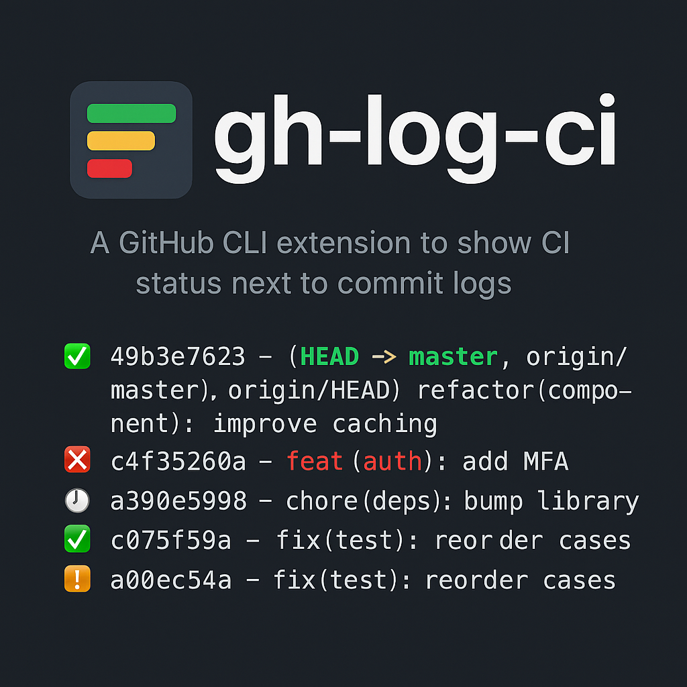

<p align="center">
  
</p>

<h1 align="center">gh-log-ci</h1>
<p align="center"><em>A GitHub CLI extension that shows CI status next to commit logs</em></p>

`gh log-ci` displays recent commits with an inline summary icon of their GitHub Check / Actions status so you can instantly see which commits are green, failing, pending, or cancelled.

## Quickstart

`gh log-ci` works with GitHub.com and GitHub Enterprise Server (any version that supports Checks API).

1. Install [GitHub CLI](https://cli.github.com/)
2. Authenticate: `gh auth login`
3. (Optional) Ensure you have access to private repos you care about
4. Install the extension: `gh extension install xpepper/gh-log-ci` (or `gh extension install .` from local checkout)
5. Run: `gh log-ci` on a GitHub repo
6. Profit! ✅ 🚀

## Usage

Basic usage (auto-detect default branch):
```shell
gh log-ci
```

### Flags
```
  --branch <name>        Use a specific branch (overrides auto-detect)
  --limit, -n <n>        Number of commits to display (default: 15; env LOG_CI_LIMIT)
  --concurrency, -c <n>  Parallel API calls (default: 4; env LOG_CI_CONCURRENCY)
  --checks, -C           Show per-check run summaries
  --no-spinner           Disable loading spinner (env LOG_CI_NO_SPINNER=1)
  --api-timeout <secs>   Max seconds per API request (default: 30; env LOG_CI_API_TIMEOUT)
  --watch                Continuously poll and update commit statuses
  --watch-interval <s>   Seconds between polls in watch mode (default: 10; env LOG_CI_WATCH_INTERVAL)
  --no-cache             Ignore success cache, force fresh API calls for all commits
  --use-rest             Force REST API mode, bypass GraphQL (env LOG_CI_FORCE_REST=1)
  --help, -h             Show help / usage
  --version              Show version
```

Help example:
```shell
$ gh log-ci --help
gh log-ci - show CI status next to recent commits

Usage:
  gh log-ci [options] [<branch>|<commit-sha>]

Options:
  --branch <name>        Branch to inspect (alternative to positional <branch>)
  --limit, -n <n>        Number of commits to display (default: 15; env LOG_CI_LIMIT)
  --concurrency, -c <n>  Parallel API calls (default: 4; env LOG_CI_CONCURRENCY)
  --checks, -C           Show per-check run summaries
  --no-spinner           Disable loading spinner (env LOG_CI_NO_SPINNER=1)
  --api-timeout <secs>   Max seconds per API request (default: 30; env LOG_CI_API_TIMEOUT)
  --use-rest             Force REST API mode, bypass GraphQL (env LOG_CI_FORCE_REST=1)
  --help, -h             Show this help text
  --version              Show version
  --no-cache             Ignore success cache, force fresh API calls for all commits

```

Specify a branch explicitly:
```shell
gh log-ci release-branch
```
Branch resolution order when no argument is provided:
1. GitHub default branch (`gh repo view --json defaultBranchRef --jq .defaultBranchRef.name`)
2. `master` if present
3. `main` if present
4. Current local HEAD branch

### Commit SHA Mode

You can also pass a commit SHA (full or short) to check the CI status of a single commit:

```shell
# Full commit SHA
gh log-ci 1055e83327fe2415e117ec67fbc8412f9093504f

# Short commit SHA (at least 7 characters)
gh log-ci 1055e83

# Using git rev-parse output
gh log-ci $(git rev-parse HEAD~5)
```

In commit SHA mode:
- Shows exactly 1 commit (the specified SHA)
- No remote branch warnings
- Works with both GraphQL (default) and REST API modes (`--use-rest`)
- Accepts both full 40-character SHAs and short SHAs (≥7 characters)


## Output Example
```
$ gh log-ci
✅  49b3e7623 - (HEAD -> master, origin/master, origin/HEAD) refactor(component): improve caching (Wed Oct 22 15:15:13 2025 +0200) <Jane Doe>
❌  c4f35260a - feat(auth): add MFA (Wed Oct 22 09:25:09 2025 +0200) <John Smith>
🕓  a390e5998 - chore(deps): bump library (Tue Oct 21 16:52:40 2025 +0200) <dependabot[bot]>
```

## Icons Legend
| Icon | Meaning |
|------|---------|
| ✅ | All completed check runs succeeded (no failures/pending) |
| ❌ | At least one failing/timed_out/action_required check run |
| 🕓 | One or more check runs still in progress / queued and no failures yet |
| 🔁 | Queued run blocked by earlier in-progress run of same workflow |
| 🚫 | One or more cancelled runs and no failures/pending (takes precedence over success) |
| ⚠ | Mixed: successes and failures both present |
| ⏲ | Timed out while fetching check runs (API didn't respond within --api-timeout) |
| ➖ | Neutral/skipped/stale (shown only in per-check detail) |
| ❔ | Fallback / unknown state |

## Features
| Capability | Description |
|------------|-------------|
| Auto branch | Detects default branch, falls back to master/main/HEAD |
| Commit SHA mode | Check CI status for a single commit by SHA (full or short) |
| Status aggregation | Smarter overall icon (pending vs all-green vs mixed failure) |
| GraphQL batch query | Single batch query fetches all commit statuses (use --use-rest for REST API mode) |
| Per-check summaries | Optional detailed list via `--checks` / `LOG_CI_SHOW_CHECKS=1` |
| Parallel fetching | Concurrency-controlled API calls (`--concurrency`) |
| Colorized log | Mirrors `git log` pretty format with colors |
| Lightweight | Single Bash script, no external deps beyond `gh` |
| Progress spinner | Shows animated spinner with live completed/total count (disable with --no-spinner) |
| API timeouts | Per-request timeout preventing hangs (`--api-timeout`, shows ⏲ on timeout) |
| Watch mode | Continuously polls to surface new commits and evolving statuses (`--watch`, `--watch-interval`) |
| Success caching | Skips API calls for commits already successful within TTL (success-only, configurable) |
| Blocked detection | Distinguishes queued runs blocked by in-progress workflow (🔁 icon) |
| Time-based filtering | Excludes scheduled workflows from status aggregation while keeping them visible with `-C` |

## Time-Based Filtering

By default, `gh-log-ci` only includes check suites created within 4 hours of the commit when computing the overall status icon. This prevents scheduled workflows (like Dependabot running at 3 AM) from incorrectly marking commits as failed.

GitHub associates check suites with the HEAD commit at run time, not the commit that triggered the suite. Without time filtering, scheduled workflows would affect the status of otherwise successful commits.

**Excluded checks are still displayed** when using the `-C` flag, marked with a ⏱ icon and `[excluded]` label for visibility.

Configure the threshold with `LOG_CI_TIME_FILTER_HOURS`:

```bash
# Strict: only checks within 1 hour
LOG_CI_TIME_FILTER_HOURS=1 gh log-ci

# Permissive: checks within 24 hours
LOG_CI_TIME_FILTER_HOURS=24 gh log-ci

# Disable filtering: include all checks
LOG_CI_TIME_FILTER_HOURS=999999 gh log-ci
```

## Permissions

`gh log-ci` uses the credentials configured via [`gh auth login`](https://cli.github.com/manual/gh_auth_login) or any supported `gh` environment variables. Required scopes depend on what you want to read:

Typical token (user) scopes:
- `repo` (private repository commit metadata & checks)
- `read:org` (if accessing private org repos)

GitHub App / server-to-server tokens need read access to:
- Repository Contents
- Repository Metadata
- Actions / Checks (implicitly via Checks API)

If you see authentication errors, re-run:
```shell
gh auth status
gh auth login
```

## How It Works
1. Determines input type (branch name or commit SHA).
2. **For branch mode**: Fetches commits from `origin/<branch>`. **For commit SHA mode**: Validates and resolves the SHA.
3. Emits a tab-delimited `git log` (single commit for SHA mode, last 15 for branch mode).
4. **GraphQL batch query (default)**: Executes a single GraphQL query to fetch check run status for all commits at once (reduces API calls by ~93% for 15 commits). For commit SHA mode, queries the specific commit object.
5. **REST API mode (explicit)**: Use `--use-rest` flag or `LOG_CI_FORCE_REST=1` to make individual REST API calls per commit instead. Required for:
   - GitHub Enterprise Server versions < 3.4 (GraphQL Checks API unavailable)
   - Commits with >100 check suites (GraphQL query limit)
   - Troubleshooting or comparing GraphQL vs REST behavior
6. Maps combined conclusions to an icon and prints decorated line.

### When to Use REST Mode

By default, `gh log-ci` uses GraphQL batch queries for optimal performance. Use REST mode (`--use-rest` or `LOG_CI_FORCE_REST=1`) when:

- **GitHub Enterprise Server < 3.4**: GraphQL Checks API not available on older GHES versions
- **Commits with >100 check suites**: GraphQL query limited to 100 check suites per commit
- **GraphQL errors**: If you encounter GraphQL API errors, the tool will suggest using `--use-rest` as a workaround
- **Debugging**: Comparing behavior between GraphQL and REST API responses

Example:
```shell
# Force REST API mode with flag
gh log-ci --use-rest

# Force REST API mode with environment variable
LOG_CI_FORCE_REST=1 gh log-ci

# Combine with other options
gh log-ci --use-rest --concurrency 8 --limit 20
```

## Configuration (Current)
- Branch: positional argument or `--branch` (auto-detected if omitted).
- Commit count: `--limit` / `-n` (default 15) or environment `LOG_CI_LIMIT`.
- Concurrency: `--concurrency` / `-c` (default 4) or environment `LOG_CI_CONCURRENCY`.
- Per-check detail: `--checks` / `-C` or environment `LOG_CI_SHOW_CHECKS=1`.
- Spinner: disable with `--no-spinner` or `LOG_CI_NO_SPINNER=1`.
- API request timeout: `--api-timeout <secs>` (default 30) or `LOG_CI_API_TIMEOUT`.
- Watch mode: `--watch` continuously refresh; `--watch-interval <s>` (default 10) or `LOG_CI_WATCH_INTERVAL`.
- Success cache (success-only): TTL `LOG_CI_CACHE_TTL` (default 86400s / 24h); directory `LOG_CI_CACHE_DIR` (default ~/.cache/gh-log-ci); debug `LOG_CI_CACHE_DEBUG=1`.
- Cache bypass: `--no-cache` to force fresh API calls for all commits.
- Time filtering: `LOG_CI_TIME_FILTER_HOURS` (default 4) excludes check suites created beyond threshold from status aggregation; excluded checks displayed with `-C`.
- REST API mode: `--use-rest` flag or `LOG_CI_FORCE_REST=1` to bypass GraphQL (required for GHES <3.4).

## Limitations
- Per-check summaries increase output size (consider piping/grep).
- Neutral/skipped/stale checks don't affect overall icon yet.
- No JSON / alternative formats yet.
- Assumes `origin` remote name.
- GraphQL queries limited to 100 check suites per commit (use `--use-rest` for commits with >100 suites).

## Roadmap
- Rate-limit handling with backoff + user notice.
- Workflow names and URLs (opt-in with a flag).
- Filtering: author, status, date range, grep on commit message.
- Semantic versioning policy (documented in README).

## Testing
We use [bats](https://github.com/bats-core/bats-core) for basic behavioral tests and [shellcheck](https://www.shellcheck.net/) for static analysis.

Run locally:
```bash
shellcheck gh-log-ci
bats tests
```
CI runs automatically on pushes / PRs (see `.github/workflows/ci.yml`).

Convenience local CI script (runs both):
```bash
./ci-local.sh
```

Without Homebrew (alternative via Docker):
```bash
docker run --rm -v "$PWD":/work -w /work ubuntu:22.04 bash -c \
  "apt-get update && apt-get install -y bats shellcheck git && bats tests"
```

## Makefile Tasks

For easier development and maintenance, this project includes a Makefile with common tasks:

```bash
make help              # List all available tasks
make test              # Run all tests (shellcheck + bats)
make shellcheck        # Run shellcheck only
make bats              # Run bats tests only
make ci-local          # Run local CI script
make clean-cache       # Remove all cache files
make list-cache        # List cache files
```

See `make help` for a complete list of available tasks.

## Contributing
1. Fork and clone.
2. Create a feature branch.
3. Make changes + add tests (when available).
4. Open a PR.

## Troubleshooting
| Issue | Suggestion |
|-------|------------|
| Remote URL error | Ensure you're inside a GitHub repo with an `origin` remote |
| Auth errors | Run `gh auth status` then `gh auth login` |
| All 🕓 icons | Checks not started yet or using legacy status API |
| GraphQL errors | Try `--use-rest` flag to bypass GraphQL (required for GHES <3.4) |
| Slow output | Use GraphQL mode (default) for best performance; reduce `--limit` if needed |

## License
See `LICENSE`.

## Disclaimer
This tool is under active development. While stable for everyday use, expect new features and improvements in future releases.

## Changelog

| Version | Date | Notes |
|---------|------|-------|
| 0.7.0 | 2026-01-06 | GraphQL batch query (93% API call reduction); `--use-rest` flag for GHES <3.4 compatibility; 54% faster for 15+ commits |
| 0.6.0 | 2025-11-17 | Distinguish blocked queued runs (🔁 icon); update legend & features |
| 0.5.0 | 2025-11-04 | Add --no-cache flag to bypass success cache and force fresh API calls |
| 0.4.1 | 2025-10-23 | Success-only caching (TTL, dir config, debug env) skips API calls for cached successes |
| 0.4.0 | 2025-10-22 | Watch mode (`--watch`, `--watch-interval`); refactored core for repeated polling |
| 0.3.4 | 2025-10-22 | Progress-aware spinner (`--no-spinner`) option (shows completed/total); per-request `--api-timeout` with ⏲ icon on timeout |
| 0.3.3 | 2025-10-22 | Removed header banner from output for compact display |
| 0.3.2 | 2025-10-22 | Cancelled status precedence fix (show 🚫 when any cancelled and no failures) |
| 0.3.1 | 2025-10-22 | Added tests (bats) & CI workflow (shellcheck + tests) |
| 0.3.0 | 2025-10-22 | Per-check summaries (`--checks`) and richer status aggregation |
| 0.2.0 | 2025-10-22 | Concurrency flag (`--concurrency`) parallel API calls |
| 0.1.0 | 2025-10-22 | Basic functionality with branch auto-detect & limit |
